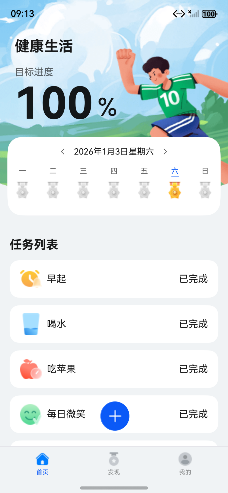
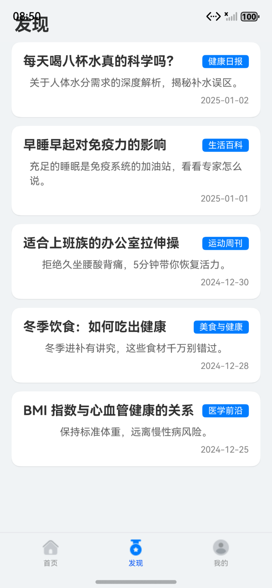
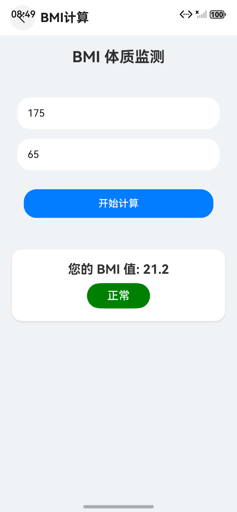
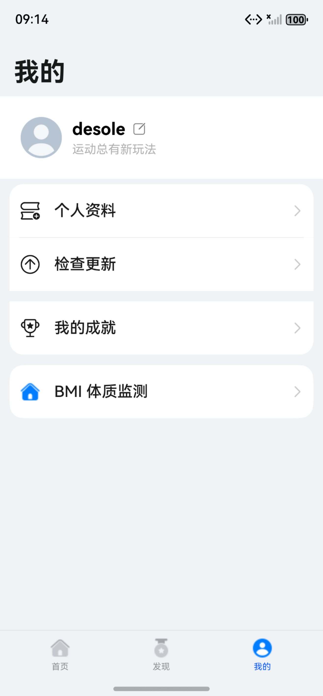

HealthyLife - 鸿蒙健康生活智能管家

📖 项目简介

本项目是基于华为官方 HealthyLife 示例工程进行深度开发和功能扩展的 HarmonyOS 应用。项目采用 ArkTS 语言开发，基于 Stage 模型，遵循 MVVM 架构设计规范。

在保留原有健康任务打卡、成就系统等核心功能的基础上，本项目新增了 BMI 体质监测、健康资讯网络服务以及个性化配置持久化三大模块，旨在将应用从单一的“打卡工具”升级为全方位的“智能健康管家”。

✨ 核心功能

1. 🚀 原有核心功能 (Base Features)

多维健康任务管理：支持早起、喝水、吃苹果、每日微笑、刷牙、早睡等 6 类核心健康任务的创建与管理，支持自定义目标与提醒频率。

可视化打卡体系：主页提供便捷打卡交互，通过动态环形进度条实时展示当日任务完成率。

成就激励系统：基于连续打卡天数（3/7/30/50/73/99天）自动解锁勋章，提供可视化的荣誉墙。

元服务卡片 (Service Widgets)：支持 2x2 和 2x4 两种桌面卡片，实现桌面一键查看进度与快速拉起应用。

2. 🌟 新增功能模块 (New Features - 期末大作业重点)

🏃 阶段一：BMI 体质监测子系统

功能描述：在“我的”页面新增体质监测入口。用户输入身高、体重数据后，系统自动计算 BMI 指数。

交互体验：计算结果以动态颜色条展示（蓝色-偏瘦，绿色-正常，红色-超重），直观反馈身体状态。

技术点：表单输入处理、数值逻辑运算、条件渲染、动态样式绑定。

📰 阶段二：健康资讯网络服务

功能描述：底部导航栏新增 “发现” (Discovery) 模块。

逻辑实现：构建了模拟 HTTP 网络通信层，通过异步机制 (Promise + async/await) 获取云端健康百科数据。

界面展示：实现了带有加载状态 (LoadingProgress) 的资讯列表页，点击可查看详情，补充了应用的资讯属性。

国际化：全模块支持中英文无缝切换。

⚙️ 阶段三：个性化配置中心 (持久化)

功能描述：支持用户修改个人昵称，并确保数据在应用重启后不丢失。

技术实现：引入 HarmonyOS 首选项 (Preferences) 轻量级存储技术，实现了用户配置数据的本地持久化保存。

交互优化：通过自定义弹窗 (CustomDialog) 提供流畅的数据录入体验。

🛠 技术架构

本项目严格遵循高内聚、低耦合的模块化设计原则：

开发语言：ArkTS (TypeScript 扩展)

开发框架：ArkUI (声明式 UI)

应用模型：Stage 模型

架构模式：MVVM (Model-View-ViewModel)

关键技术栈：

UI 组件化：@Component, @Builder, Tabs, Navigation

状态管理：@State, @Provide/@Consume, AppStorage

异步编程：Promise, async/await 处理网络模拟

数据持久化：@ohos.data.preferences

国际化 (i18n)：全量资源文件适配 (zh_CN, en_US, base)

📂 项目结构概览

HealthyLife/
├── commons/                  # 公共基础库
│   └── common/               # 常量、工具类、基础资源
├── features/                 # 业务功能模块
│   └── healthylife/
│       ├── src/main/ets/
│       │   ├── model/        # 数据模型 (HealthNewsModel, NavItemModel...)
│       │   ├── viewmodel/    # 视图模型 (AchievementStore...)
│       │   ├── views/        # UI 组件
│       │   │   ├── BMIComponent.ets        # [新增] BMI 计算页
│       │   │   ├── DiscoveryComponent.ets  # [新增] 发现页
│       │   │   ├── MineComponent.ets       # 我的页
│       │   │   ├── HomeComponent.ets       # 首页
│       │   │   └── ...
│       │   └── pages/
│       │       └── HealthyLifePage.ets     # 主入口 (Tabs 容器)
│       └── ...
└── products/                 # 产品/入口模块
└── default/              # EntryAbility

🖥️ 环境要求

IDE: DevEco Studio 6.0.1 或更高版本

SDK: HarmonyOS NEXT (API 12+)

语言: ArkTS

🚀 快速开始

克隆项目：下载本项目源码到本地。

导入 DevEco Studio：选择项目根目录下的 build-profile.json5 或直接打开文件夹。

配置签名：

进入 File > Project Structure > Project > Signing Configs。

勾选 Automatically generate signature。

同步依赖：点击右上角的 Sync Now 确保 Hvigor 构建正常。

运行：连接真机或启动模拟器，点击 Run 按钮。

📸 运行效果

首页 (Home)

发现 (Discovery)

BMI 监测 (BMI)

个人中心 (Mine)

作者：吴宇辰
日期：2025年1月